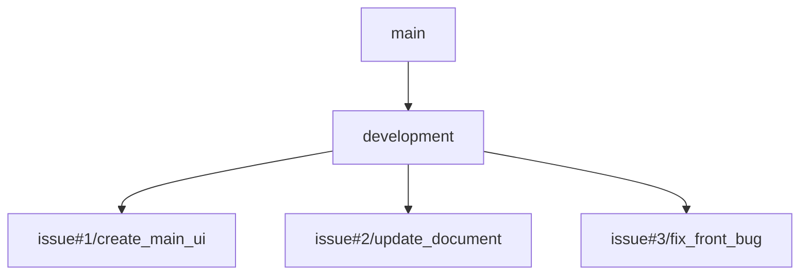

# 概要

ブランチの切り方(git-flow)を記載しています。

## ブランチ図

```mermaid
flowchart TD
  main-->development
  development-->issue#1/create_main_ui
  development-->issue#2/update_document
  development-->issue#3/fix_front_bug
```

## 詳細

* main

    サーバにデプロイして確実に動く確証のあるブランチ。

* development

    開発用のブランチ。

* developmentからの派生ブランチ

    Issueベースでdevelopmentから切る。
    サブタイトルに、修正内容を記載する。